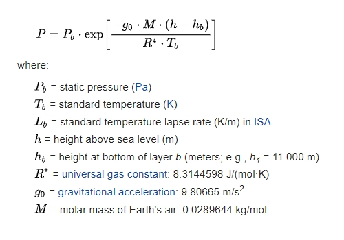

# ElevaTorr:

Code for ElevaTorr, a simple altimeter that gives good approximations 
of elevation changes based on direct readings from the device's pressure sensor (barometer).

Access to barometer is enabled using [enviro_sensors plugin package](https://pub.dev/packages/enviro_sensors).
iOS is not supported in this version but will be in the future.

## How to use?

Download the app from [Google Play](https://play.google.com/store/apps/details?id=com.barbadose.elevatorr_second), the first altitude displayed 
is a reasonable estimation of the elevation difference from sea level, this estimation, however, is not very accurate.
Once you press the "reset" button to set the altimeter at 0, future changes in elevation are displayed, these 
are pretty decent approximations and maintain an accuracy of 1-2 meters while temperature variations are not drastic.

## How does it work?

The readings from the highly sensitive smartphone barometer combined with other constants using what is known as ["the barometric formula"](https://en.wikipedia.org/wiki/Barometric_formula).
 

 
The barometric formula, sometimes called the exponential atmosphere or isothermal atmosphere, is a formula used to model how the pressure (or density) of the air changes with altitude. The pressure drops approximately by 11.3 Pa per meter in first 1000 meters above sea level.
For this application, the temperature lapse rate (the rate of temperature change with changes in altitude) was omitted.

Funnily enough, even this ElevaTorr app does not measure pressure in Torr.
